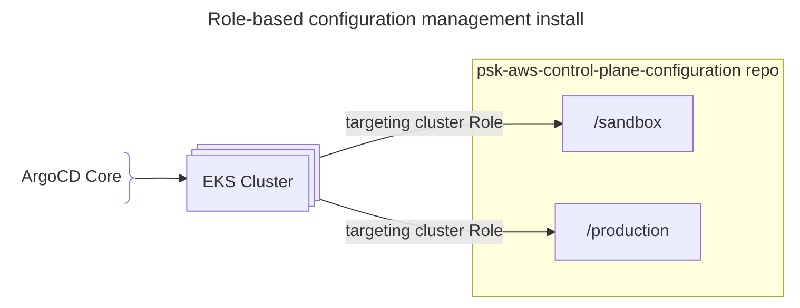
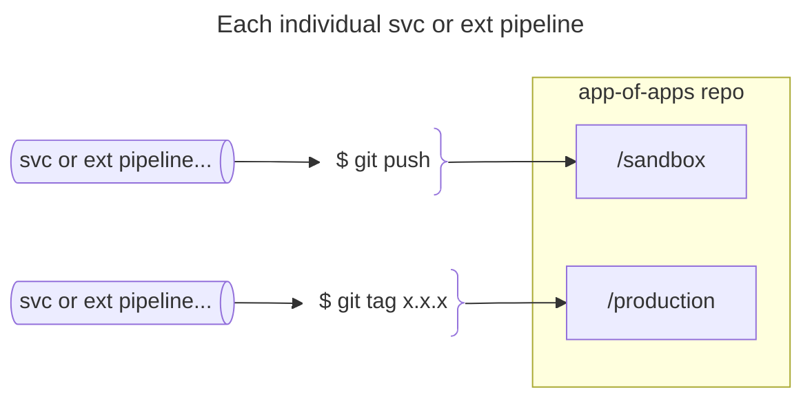

<div align="center">
	<p>
	
	<h2>psk-platform-svc-dist-control-plane-config</h2>
	<a href="https://opensource.org/licenses/MIT"></a> <a href="https://aws.amazon.com"></a>
	</p>
</div>

Deploy argocd core to control plane and link to centralized 'role-based' configuration repo. The cluster is mapped to a role in an argo app-of-apps cofiguration repp which maintains all the cluster-level services and extensions.  

This configuration is based on a standard Application definition (app-of-apps) in order to support enforced syncWave order values.  


The configuration repo is [psk-aws-control-plane-configuration](https://github.com/twplatformlabs/psk-aws-control-plane-configuration) and defines all the services and extensions for the cluster with the specific deployment configuration values.  
```bash
roles/
├── sandbox/
│   ├── external-secrets-operator/
│   ├── crossplane/
│   ├── metrics-server/
│   ├── kube-state-metrics/
│   ├── otel-collector/
│   ├── cert-manager/
│   ├── external-dns/
│   └── istio/
│
├── production
│   ├── external-secrets-operator/
│   ├── crossplane/
│   ├── metrics-server/
│   ├── kube-state-metrics/
│   ...
```

Ihe individual service or extension pipelines define the change release for the application by modifying the respective information in the app-of-apps repo.

Currently the application pipelines also manage integration testing and therefore must be aware of each cluster in order to perform testing. These pipeline would also benefit from creating a central list of clusters by-role where the application pipeline could dynamically generate a parallelized testing pipeline.

### maintainers

**Upgrades**  

The install script uses the environment defined argocd version value to map to the core menifest file in particular folder. For example, argocd v3.3.7 manifests are in the `argocd-core-manifest-3.3.7` folder.  

To upgrade argocd core, follow the upgrade instructions [here](doc/upgrade-manifeset.md).  

The install script defines an org sa access token. The role configuration registers the configuration repo.  

**UI access**

```bash
argocd login --core     # uses current kubeconfig context
argocd admin dashboard  # then launches a dashboard locally

starting dashboard
Argo CD UI is available at http://localhost:8080
```
